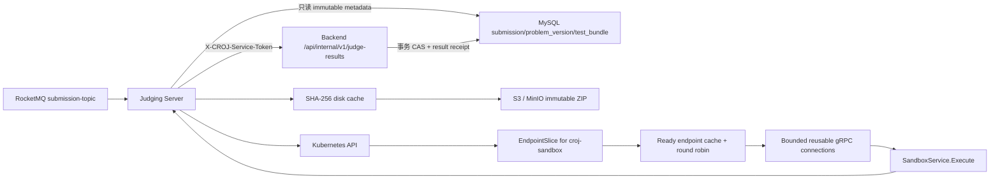

# CodeRushOJ Judging Server

Go 判题编排服务，负责消费 `submission-topic`、读取提交快照、发现可用沙箱、执行代码并把结果幂等回调给后端。仓库正在从早期 ZooKeeper + 模拟判题原型演进为 Kubernetes 原生的真实判题控制面。

> 当前状态：Kubernetes EndpointSlice 发现、版本化消息、认证幂等结果回调和不可变 ACM 隐藏测试包链路已经接通。上线 exact checker 前必须先合入 [`croj-sandbox#10`](https://github.com/CodeRushOJ/croj-sandbox/issues/10) 的日志脱敏修复，否则旧 sandbox 会把 WA 的 expected/actual 写入 Pod 日志。

面向外部 OJ 的版本化异步 REST 适配器正在 Draft PR #17 中实施。已有切片包括 RFC 9457 错误、请求 ID、不透明 API Key 的 peppered HMAC 验证与 scope、`GET /api/v1/capabilities`、Judge 自有 MySQL 迁移、租户/密钥预置、不可变 hidden bundle 上传/元数据端点，以及 `POST /api/v1/judge-jobs`、任务列表/详情/取消的脱敏 HTTP 合约和 lease/attempt 状态机。Webhook 已具备精确载荷 HMAC 签名、禁止重定向、状态重试矩阵及 DNS rebinding/私网 SSRF 防护；Redis 原子令牌桶使用服务端时间，在多副本间统一限制任务提交和 bundle 实际上传字节，配额不可用时新写入 fail closed 为 `503`，读取继续可用。在 MySQL job/outbox repository、worker 和 E2E 门禁完成前，该 HTTP 端口不标记为可发布。

## 架构



发现器只读取带 `kubernetes.io/service-name=croj-sandbox` 标签的 EndpointSlice，只保留 `Ready=true` 且非 `Terminating` 的 TCP 地址。Kubernetes API 暂时失败时，调度器保留最后一次成功快照；API 成功返回空集合时立即停止分配，避免继续调用已删除 Pod。

每个 endpoint 复用一个 gRPC `ClientConn`；连接缓存同时受最大容量和空闲 TTL 约束。每个 case 的 `Unavailable`、`ResourceExhausted`、`Sandbox Error` 或未知状态会在有界次数内换下一个 Ready endpoint。若全部尝试都是 `Unavailable`/`ResourceExhausted`，服务保留原 gRPC code 并交给 RocketMQ 重试，不会把短暂过载发布成终态 `SYSTEM_ERROR`；sandbox 已返回但内容为空、状态未知或为 `Sandbox Error` 时才按损坏的基础设施响应终结。CE/WA/TLE/MLE/RE/OLE 等选手终态不重试。OLE 在 callback v1 暂映射为 `RUNTIME_ERROR`，正式枚举由 Issue #13 跟进。

消息必须是严格的 `SubmissionRequested` v1 JSON：

```json
{"schemaVersion":1,"eventId":"50f75fdf-fdea-473f-a156-bf1ed60acf58","submissionId":99,"attemptNo":1,"problemId":42,"userId":7,"language":"java17"}
```

未知字段、非 UUID `eventId`、不支持的版本和非法标识会被永久拒绝并 ACK。进程内任务注册表按 `eventId/submissionId/attemptNo` 合并并发重复消息；回调临时失败时复用完全相同的结果，`eventId` 直接作为稳定 `resultId`。后端返回 `200 APPLIED/DUPLICATE` 时完成，`400/403/404/409` 等契约错误视为永久结果并 ACK；网络错误、`401/408/425/429` 和 `5xx` 重试。RocketMQ 重试超过配置上限后投递到 consumer group 的 DLQ，后端 result receipt 是跨进程、跨副本的最终幂等权威。

判题服务不再直接写 MySQL。它只读加载提交源码、`submission.problem_version_id` 指定的唯一 `t_problem_version` 和对应 `t_test_bundle`，建议使用只读数据库账号。执行限制与判题模式只来自不可变版本的 `limits_json` / `judge_config_json`；版本 ID、题目 ID 必须与提交一致且状态必须为 `PUBLISHED`。可变 `t_problem` 不参与主判题链。

## 隐藏测试包 v1

对象必须是确定性 ZIP，必须包含根目录 `manifest.json`。ZIP 全文件 SHA-256、压缩大小和 `manifest.json` 规范结构必须分别与 `t_test_bundle.sha256`、`size_bytes`、`manifest_json` 一致；任何一项不一致都返回 `SYSTEM_ERROR`，不会选择其中一份覆盖另一份。

```json
{
  "schemaVersion": 1,
  "judgeMode": "ACM",
  "checker": "exact",
  "cases": [
    {"id": "case-01", "input": "cases/01.in", "output": "cases/01.out", "weight": 1}
  ]
}
```

仅支持 `ACM` 的 `exact` 与 `token`。SPJ/OI 会明确返回 `SYSTEM_ERROR`，由 Issue #12 跟进。`exact` 与 sandbox 保持相同规则：CRLF/CR 统一为 LF，每行 `TrimSpace` 后再移除整体首尾空白；`token` 在 judging 侧按 Unicode whitespace 分词比较。case 按 manifest 顺序执行，首个选手错误早停，最终时间/内存取所有已完成 case 的最大值。

隐藏包路径把 sandbox 视为不可信边界：callback 不转发 stdout、hidden input/output 或 sandbox 诊断。编译错误仅返回固定的 `compilation failed; diagnostics redacted`；后续若要恢复安全的编译诊断，必须由独立的结构化编译阶段提供，不允许从已接触 hidden case 的响应中透传自由文本。

读取 ZIP 前会拒绝未知字段、重复 ID/路径、绝对路径、反斜杠、路径穿越、符号链接、非普通文件、加密/未知压缩方法、zip bomb、超量文件和解压大小越界。文件不会解压到目录。`WriteDeterministicArchive` 可生成固定时间戳、固定权限、排序 entry 的可复现 artifact，并返回应写入数据库的规范 manifest JSON。

缓存以 SHA-256 为键，下载时流式执行 size/SHA-256 校验并原子 rename；并发 miss 合并为一次下载，命中会重新校验，损坏后自动重拉。同一 SHA-256 可跨不同 object key 复用完全相同的字节，但每一条数据库元数据的期望 size/SHA-256 都会独立复核；object key 仅是下载定位符。进程启动会删除本 cache 目录中的旧 ZIP、临时文件和同名 symlink，不跟随链接；因此该目录必须是 judging 专用 emptyDir。

## 技术基线

- Go 1.26
- Kubernetes/client-go 0.36.2（对应 Kubernetes 1.36）
- RocketMQ Go Client 2.1.2
- GORM + MySQL（只读兼容查询）
- MinIO Go SDK（S3-compatible immutable bundle 读取）
- go-redis v9（Redis 服务端时间 + Lua 原子令牌桶，多副本写入配额）
- Kubernetes Service、EndpointSlice 与 namespace 级最小权限 RBAC

不再依赖 ZooKeeper。

## 配置

默认配置位于 `configs/config.yaml`，适配 `coderushoj` namespace 中的平台服务。Secret 不写入文件，部署时必须通过环境变量或 Kubernetes Secret 注入数据库凭据和不少于 32 字节的 `JUDGE_RESULT_SERVICE_TOKEN`。该 token 必须和后端使用同一个 Secret。

常用覆盖变量：

| 环境变量 | 用途 | 默认来源 |
| --- | --- | --- |
| `DATABASE_HOST` / `DATABASE_PORT` | MySQL 地址 | YAML |
| `DATABASE_USERNAME` / `DATABASE_PASSWORD` / `DATABASE_NAME` | MySQL 只读凭据和库名 | YAML / Secret |
| `ROCKETMQ_NAME_SERVER` | NameServer 地址 | YAML |
| `SUBMISSION_TOPIC` / `ROCKETMQ_CONSUMER_GROUP` | 消费主题和消费组 | YAML |
| `ROCKETMQ_MAX_RECONSUME_TIMES` | 临时失败最大重试次数，超限进入 `%DLQ%<consumer-group>` | YAML |
| `BACKEND_INTERNAL_URL` | 后端内部地址，必须包含 `/api` | YAML |
| `JUDGE_RESULT_SERVICE_TOKEN` | 判题结果回调共享密钥，至少 32 字节 | Secret（必填） |
| `JUDGE_RESULT_CALLBACK_TIMEOUT` | 单次 HTTP 回调 timeout | YAML |
| `JUDGE_TASK_CACHE_CAPACITY` / `JUDGE_TASK_CACHE_TTL` | 进程内幂等任务表容量与完成项 TTL | YAML |
| `OBJECT_STORAGE_ENDPOINT` / `OBJECT_STORAGE_BUCKET` / `OBJECT_STORAGE_REGION` / `OBJECT_STORAGE_USE_TLS` | S3/MinIO 只读对象存储，endpoint 为 `host[:port]`，不含 scheme/path | YAML |
| `OBJECT_STORAGE_ACCESS_KEY` / `OBJECT_STORAGE_SECRET_KEY` | S3/MinIO 只读凭据 | Secret（必填） |
| `JUDGE_BUNDLE_CACHE_DIR` / `JUDGE_BUNDLE_CACHE_MAX_BYTES` / `JUDGE_BUNDLE_CACHE_TTL` | 专用 emptyDir 路径、容量与 TTL | YAML / emptyDir |
| `JUDGE_BUNDLE_MAX_OBJECT_BYTES` | ZIP 压缩体积上限 | YAML |
| `JUDGE_BUNDLE_MAX_FILES` / `JUDGE_BUNDLE_MAX_MANIFEST_BYTES` / `JUDGE_BUNDLE_MAX_CASE_BYTES` | ZIP 文件数、manifest、单 case 文件限制 | YAML |
| `JUDGE_BUNDLE_MAX_UNCOMPRESSED_BYTES` / `JUDGE_BUNDLE_MAX_COMPRESSION_RATIO` | zip bomb 防护限制 | YAML |
| `JUDGE_BUNDLE_MAX_INFRA_ATTEMPTS` | 每 case 基础设施故障换 endpoint 上限 | YAML |
| `SANDBOX_NAMESPACE` / `SANDBOX_SERVICE` / `SANDBOX_PORT_NAME` | EndpointSlice 选择目标（默认 gRPC 端口名 `grpc`） | YAML |
| `SANDBOX_REFRESH_INTERVAL` | 刷新周期，如 `5s` | YAML |
| `SANDBOX_EXECUTE_TIMEOUT` | 单次 gRPC Execute 的总 deadline，如 `60s` | YAML |
| `SANDBOX_MAX_CONNECTIONS` / `SANDBOX_CONNECTION_IDLE_TTL` | gRPC endpoint 连接缓存容量和空闲回收时间 | YAML |
| `KUBECONFIG` | 集群外开发时的 kubeconfig 路径 | client-go 默认规则 |

集群内优先使用 ServiceAccount token；集群外自动使用 `KUBECONFIG` 或 `$HOME/.kube/config`。

## 本地测试

宿主机无需安装 Go：

```bash
docker run --rm \
  -v "$PWD:/workspace" \
  -v coderushoj-go-cache:/go/pkg/mod \
  -w /workspace golang:1.26.3 \
  go test -race ./...
```

`internal/integration/judge_sandbox_contract_test.go` 使用一次性的 fake Kubernetes API、真实 TCP gRPC server 和 HTTP callback 验证完整进程内契约：EndpointSlice churn、过载换节点、不可变 ZIP/SHA-256、隐藏 case 执行和 callback 脱敏。测试不要求也不会启动持久集群或服务。

静态检查和构建：

```bash
docker run --rm \
  -v "$PWD:/workspace" \
  -v coderushoj-go-cache:/go/pkg/mod \
  -w /workspace golang:1.26.3 \
  sh -c 'go vet ./... && CGO_ENABLED=0 go build -trimpath -o /tmp/judging-server ./cmd'
```

## 外部 OJ 租户预置（开发中）

`judge-admin` 使用与运行时相同的不可变迁移和仓储，新 API Key 只在标准输出显示一次；MySQL 只保留 lookup prefix 和 `HMAC-SHA256(pepper, full-key)`。不要把 DSN、pepper 或输出的 key 写入仓库、shell history 或日志。

```bash
export JUDGE_DATABASE_DSN='judge_admin:...@tcp(127.0.0.1:3306)/coderushoj_judge?parseTime=true&charset=utf8mb4'
export JUDGE_API_KEY_PEPPER_B64="$(openssl rand -base64 32)"

go run ./cmd/judge-admin tenant create \
  --name 'Example OJ' --max-queued 100 --max-running 4 \
  --max-source-bytes 1048576 --max-bundles 200 \
  --daily-execution-ms 3600000 --max-infra-tries 3

go run ./cmd/judge-admin api-key create \
  --tenant '<26-character-tenant-id>' \
  --scopes 'capabilities:read,bundle:write,bundle:read,job:submit,job:read,job:cancel'
```

在 Kubernetes 中，DSN 和 pepper 必须来自 Secret；上面的 `export` 只是本机演示。建立租户时会执行 Judge 自有 schema 迁移，通过 MySQL advisory lock 串行化并验证已发布迁移的 SHA-256；不会修改 Backend 的 Flyway history。

### 外部不可变题包上传

`POST /api/v1/bundles` 只接受一个名为 `bundle` 的 multipart 文件和 16–128 字节可见 ASCII `Idempotency-Key`。HTTP 外层和 Service 内层分别执行请求体/文件体积上限；文件流式写入专用临时文件并同步计算 SHA-256，取消、超限或校验失败都会清理临时文件。安全校验与内部 immutable bundle 共用同一条 ZIP 路径，覆盖路径穿越、link/非普通文件、加密/未知压缩、文件数、单文件/总解压量、压缩比、manifest 严格 schema、case 成对和 256 case 协议上限；每个 case 文件还会流式读取以核对 CRC、声明大小和 UTF-8，损坏内容不会发布。

HTTP 层先用可信 `Content-Length` 对 multipart 总上限做无读取早拒绝；Service 流式落临时文件后，以实际 bundle 字节数执行一次租户 Redis 配额 admission。配额拒绝返回带 `Retry-After` 的 `429`，Redis 状态不可确认返回 `503`；两者都发生在对象 staging 和 MySQL ownership 之前，不会留下持久化半成品。

服务端只能发布到 `external/<tenant-id>/sha256/<lowercase-sha256>.zip`；请求不接受 URL、bucket 或 object key，响应也只返回 `bundleId`/digest/size/case/manifest version/创建时间。`Idempotency-Key` 使用不少于 32 字节独立 pepper 的 `HMAC-SHA256` 后才进入 MySQL，与 job API 使用同一安全语义，原始 key 不落库。

通过校验的字节先写入唯一的 `external/<tenant-id>/staging/<upload-id>/<sha256>.zip`，再提交 `PENDING` ownership。发布者必须通过 MySQL CAS 取得带过期时间的 `PUBLISHING` lease；同一 bundle 同时只有一个 promoter，其他请求返回带 `Retry-After` 的 `503` 或读取已经完成的 READY 结果。promoter 从 staging 原子复制到 final key，并通过远端 HEAD 同时核对 size 与 `x-amz-meta-sha256` 后，才可把状态改为 READY。数据库所有多行写路径固定使用 tenant→bundle 锁序；对象操作被限制在 lease 的前半段，过期 claim 不能提交 READY。

`BundleReconciler` 会持久领取到期的 PENDING/过期 PUBLISHING 行，记录 attempt、next-attempt、last-error 与 lease；客户端断线或不重放时仍可完成发布。超过最大失败次数或旧迁移留下的无 staging 行会转为 ABANDONED 并保留审计信息，绝不会无条件 backfill READY；相同内容之后重新上传时会把新 staging 对象安全挂回原 bundle，并从 PENDING 重新发布。对象存储应再为 `external/*/staging/` 配置大于数据库最大重试窗口的生命周期规则，清理数据库提交失败后无法安全判定 ownership 的唯一 staging 对象。`GET` 和判题任务 lookup 只允许 `publication_status=READY AND ready_at IS NOT NULL`；跨租户统一返回 `404`。

本地未提供 DSN 时 MySQL 集成回归会跳过；对开发专用库设置 `EXTERNAL_JUDGE_MYSQL_TEST_DSN` 后，`go test -race ./internal/integration -run ExternalBundleSQLRepositoryIntegration` 会执行迁移，并真实竞争同 key/同 hash、不同 key/同 hash、同 key/不同 hash 三种事务，断言单 bundle、单 promoter、正确幂等记录数和单一可见对象；还覆盖阻塞发布期间 `404`、客户端不重放的 durable reconciliation、失败退避及 legacy pending 的放弃与重新上传恢复。GitHub Actions 的 `mysql84-bundle-integration` job 使用 digest 固定的 MySQL 8.4.10，因此该测试在 PR 中不得 skip。

### 异步任务持久化与 worker 恢复

Judge 自有 schema v3 为 job 和 attempt 增加 256-bit lease token，并把 attempt 通过 `(job_id, tenant_id)` 复合外键绑定到租户。`MySQLJobRepository` 在同一个 InnoDB admission 事务中锁定租户策略、校验 READY 且租户自有的 bundle/callback、确认 queued quota、写入 peppered-HMAC 幂等记录以及加密源码元数据。同键同 canonical hash 返回原 job；同键不同请求返回 `409`。已确认的队列配额耗尽返回 `429`，策略或数据库状态无法确认时返回 `503`，不会开放式接收新任务。

源码先使用 AES-256-GCM 加密，tenant ID、source ID 和 key version 作为 AAD；MySQL 仅保存 digest、长度、nonce、key version 和不可公开的对象引用。对象读写由 `SourceObjectStore` 抽象提供；MinIO/S3 实现以 `If-None-Match: *` 原子创建，拒绝随机 ID 碰撞覆盖，并按数据库密文长度有界读取。写事务失败会使用独立超时上下文补偿删除。worker 读取源码前会用 job ID、attempt、worker ID、lease token 和未过期 lease 回查 MySQL 的权威元数据，不信任内存 claim 携带的 object key。

worker 领取使用 `FOR UPDATE SKIP LOCKED`，并在租户锁内重新确认 running quota。每次领取创建单独 attempt；heartbeat、完成和基础设施失败均以 attempt/worker/lease token 做 CAS。进程重启后只会回收过期 attempt，旧 worker 无法覆盖新结果；已请求取消的过期任务直接恢复为 `CANCELLED`，不会再次执行源码。基础设施失败按 tenant policy 有界重试，耗尽后才进入 `FAILED`。

当前分支提供 `httpapi.NewMySQLJobService` 适配器，但不会在未配置持久对象存储、密钥与执行 worker 时伪造运行状态。平台接线完成前 HTTP Service 保持未启用。

真实 MySQL 8.4 验证使用一次性容器，不需要启动整套 OJ：

```bash
docker run --rm -d --name croj-job-mysql \
  -e MYSQL_ROOT_PASSWORD=test-root \
  -e MYSQL_DATABASE=judge_test \
  -e MYSQL_USER=judge -e MYSQL_PASSWORD=judge-test \
  mysql:8.4.10

docker run --rm --link croj-job-mysql:mysql \
  -e JUDGE_TEST_MYSQL_DSN='judge:judge-test@tcp(mysql:3306)/judge_test?parseTime=true&loc=UTC&charset=utf8mb4' \
  -v "$PWD:/workspace" -w /workspace golang:1.26.3 \
  go test -race ./internal/external

docker stop croj-job-mysql
```

## 构建镜像

```bash
docker build -t coderushoj/judging-server:dev .
```

镜像使用多阶段构建与 distroless non-root 运行时，不包含编译器、包管理器或 shell。正式镜像由 CI 生成并由 `croj-platform` Helm values 固定 digest。

## Kubernetes 权限

`deploy/kubernetes-rbac.yaml` 提供 namespace 级 ServiceAccount、Role 和 RoleBinding，只允许 `list` EndpointSlice。部署需使用 `coderushoj-judging-server` ServiceAccount；不需要 Secret、Pod、Node 或集群级读取权限。

```bash
kubectl apply -f deploy/kubernetes-rbac.yaml
kubectl auth can-i list endpointslices.discovery.k8s.io \
  --as=system:serviceaccount:coderushoj:coderushoj-judging-server \
  -n coderushoj
```

应用部署、MySQL/RocketMQ 安装、Secret 生成、镜像固定和 Kind 多节点环境由 [`croj-platform`](https://github.com/CodeRushOJ/croj-platform) 统一管理。

## 故障排查

- `no ready sandbox endpoints`：检查 Service selector、EndpointSlice 的 Ready/Terminating 条件和端口名 `grpc`。
- `DeadlineExceeded` / `Unavailable`：检查 sandbox gRPC health、`SANDBOX_EXECUTE_TIMEOUT` 和 Pod 是否正在终止；消息会进入重试路径。
- `forbidden: endpointslices is forbidden`：确认 Deployment 使用正确 ServiceAccount，并应用 RBAC。
- 集群外无法读取 API：检查 `KUBECONFIG` 指向容器内可见路径，必要时以只读方式挂载 kubeconfig。
- RocketMQ 消费失败：核对 NameServer、topic 和 consumer group；消息体必须符合上面的 v1 JSON 契约。
- 回调持续 `401`：确认 judging-server 与 backend 引用同一个 `JUDGE_RESULT_SERVICE_TOKEN` Secret；该错误会按 RocketMQ 低频退避并最终进入 DLQ，应配置告警，服务不会记录 token。
- 回调 `5xx`：消息会重试并复用已缓存结果；检查 backend 健康状态和 `BACKEND_INTERNAL_URL` 的 `/api` context path。
- MySQL 连接失败：确认只读运行时 Secret 已注入，且数据库结构已由后端 Flyway 迁移完成。
- `immutable test bundle is invalid`：核对对象 size/SHA-256、ZIP 内外 manifest 一致性和安全限制；服务不会输出 hidden 内容。
- MinIO 失败：确认 `OBJECT_STORAGE_*`、只读 bucket policy 和 NetworkPolicy；网络错误会重试，确定性缺失/损坏会发布 `SYSTEM_ERROR`。

## 开发与版本

- 需求与验收使用 GitHub Issues 管理；Kubernetes 发现见 Issue #2，真实 gRPC Execute 见 Issue #4。
- Issue #5 交付版本化 RocketMQ payload、稳定 `resultId` 和后端 authenticated/idempotent result callback；判题进程不再直接写 MySQL。
- Issue #10 交付不可变 ACM hidden bundles；Issue #11 跟进 sandbox compile-once batch API，当前每个 case 会重复编译但不影响正确性。
- Issue #12 跟进 SPJ/OI，Issue #13 跟进原生 OLE callback 状态；未支持能力不会伪报 Accepted。
- 变更通过 `codex/*` 分支和 Draft PR 集成，不直接提交到 `main`。
- 发布遵循 SemVer，并在 GitHub Release 与平台 `CHANGELOG.md` 中记录跨仓库兼容性。
- 提交前必须通过 `go test -race ./...`、`go vet ./...` 和容器构建。

许可证见 [LICENSE](LICENSE)。
