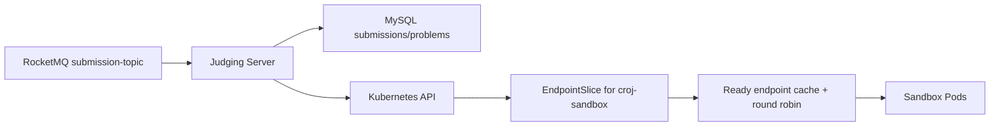

# CodeRushOJ Judging Server

Go 判题编排服务，负责消费 `submission-topic`、读取提交快照、发现可用沙箱并推进判题状态。仓库正在从早期 ZooKeeper + 模拟判题原型演进为 Kubernetes 原生、多副本安全的真实判题控制面。

> 当前状态：Kubernetes EndpointSlice 服务发现与并发安全轮询已实现；真实沙箱调用、提交抢占和完整测试点执行仍在后续 Issue 中，当前 `JudgeService` 仍保留模拟 Accepted 逻辑，不能作为生产判题结果使用。

## 架构



发现器只读取带 `kubernetes.io/service-name=croj-sandbox` 标签的 EndpointSlice，只保留 `Ready=true` 且非 `Terminating` 的 TCP 地址。Kubernetes API 暂时失败时，调度器保留最后一次成功快照；API 成功返回空集合时立即停止分配，避免继续调用已删除 Pod。

## 技术基线

- Go 1.26
- Kubernetes/client-go 0.36.2（对应 Kubernetes 1.36）
- RocketMQ Go Client 2.1.2
- GORM + MySQL
- Kubernetes Service、EndpointSlice 与 namespace 级最小权限 RBAC

不再依赖 ZooKeeper。

## 配置

默认配置位于 `configs/config.yaml`，适配 `coderushoj` namespace 中的平台服务。Secret 不写入文件，部署时至少通过环境变量注入 `DATABASE_PASSWORD`。

常用覆盖变量：

| 环境变量 | 用途 | 默认来源 |
| --- | --- | --- |
| `DATABASE_HOST` / `DATABASE_PORT` | MySQL 地址 | YAML |
| `DATABASE_USERNAME` / `DATABASE_PASSWORD` / `DATABASE_NAME` | MySQL 凭据和库名 | YAML / Secret |
| `ROCKETMQ_NAME_SERVER` | NameServer 地址 | YAML |
| `SUBMISSION_TOPIC` / `ROCKETMQ_CONSUMER_GROUP` | 消费主题和消费组 | YAML |
| `SANDBOX_NAMESPACE` / `SANDBOX_SERVICE` / `SANDBOX_PORT_NAME` | EndpointSlice 选择目标（默认 gRPC 端口名 `grpc`） | YAML |
| `SANDBOX_REFRESH_INTERVAL` | 刷新周期，如 `5s` | YAML |
| `KUBECONFIG` | 集群外开发时的 kubeconfig 路径 | client-go 默认规则 |

集群内优先使用 ServiceAccount token；集群外自动使用 `KUBECONFIG` 或 `$HOME/.kube/config`。

## 本地测试

宿主机无需安装 Go：

```bash
docker run --rm \
  -v "$PWD:/workspace" \
  -v coderushoj-go-cache:/go/pkg/mod \
  -w /workspace golang:1.26.3 \
  go test -race ./...
```

静态检查和构建：

```bash
docker run --rm \
  -v "$PWD:/workspace" \
  -v coderushoj-go-cache:/go/pkg/mod \
  -w /workspace golang:1.26.3 \
  sh -c 'go vet ./... && CGO_ENABLED=0 go build -trimpath -o /tmp/judging-server ./cmd'
```

## 构建镜像

```bash
docker build -t coderushoj/judging-server:dev .
```

镜像使用多阶段构建与 distroless non-root 运行时，不包含编译器、包管理器或 shell。正式镜像由 CI 生成并由 `croj-platform` Helm values 固定 digest。

## Kubernetes 权限

`deploy/kubernetes-rbac.yaml` 提供 namespace 级 ServiceAccount、Role 和 RoleBinding，只允许 `list` EndpointSlice。部署需使用 `coderushoj-judging-server` ServiceAccount；不需要 Secret、Pod、Node 或集群级读取权限。

```bash
kubectl apply -f deploy/kubernetes-rbac.yaml
kubectl auth can-i list endpointslices.discovery.k8s.io \
  --as=system:serviceaccount:coderushoj:coderushoj-judging-server \
  -n coderushoj
```

应用部署、MySQL/RocketMQ 安装、Secret 生成、镜像固定和 Kind 多节点环境由 [`croj-platform`](https://github.com/CodeRushOJ/croj-platform) 统一管理。

## 故障排查

- `no ready sandbox endpoints`：检查 Service selector、EndpointSlice 的 Ready/Terminating 条件和端口名 `grpc`。
- `forbidden: endpointslices is forbidden`：确认 Deployment 使用正确 ServiceAccount，并应用 RBAC。
- 集群外无法读取 API：检查 `KUBECONFIG` 指向容器内可见路径，必要时以只读方式挂载 kubeconfig。
- RocketMQ 消费失败：核对 NameServer、topic 和 consumer group；消息体应是十进制 submission ID。
- MySQL 连接失败：确认运行时 Secret 已注入，且数据库结构已由后端 Flyway 迁移完成。

## 开发与版本

- 需求与验收使用 GitHub Issues 管理；当前 Kubernetes 发现工作见 Issue #2。
- 变更通过 `codex/*` 分支和 Draft PR 集成，不直接提交到 `main`。
- 发布遵循 SemVer，并在 GitHub Release 与平台 `CHANGELOG.md` 中记录跨仓库兼容性。
- 提交前必须通过 `go test -race ./...`、`go vet ./...` 和容器构建。

许可证见 [LICENSE](LICENSE)。
