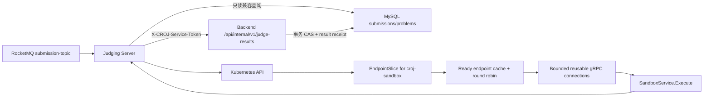

# CodeRushOJ Judging Server

Go 判题编排服务，负责消费 `submission-topic`、读取提交快照、发现可用沙箱、执行代码并把结果幂等回调给后端。仓库正在从早期 ZooKeeper + 模拟判题原型演进为 Kubernetes 原生的真实判题控制面。

> 当前状态：Kubernetes EndpointSlice 发现、并发安全轮询、`SandboxService.Execute` gRPC 调用、`SubmissionRequested` v1 消息和后端认证幂等结果回调已经接通。当前兼容链路只执行一次源码请求，尚未读取不可变隐藏测试包，因此不能把当前的 `ACCEPTED` 理解为完整题目判定。

## 架构



发现器只读取带 `kubernetes.io/service-name=croj-sandbox` 标签的 EndpointSlice，只保留 `Ready=true` 且非 `Terminating` 的 TCP 地址。Kubernetes API 暂时失败时，调度器保留最后一次成功快照；API 成功返回空集合时立即停止分配，避免继续调用已删除 Pod。

每个 endpoint 复用一个 gRPC `ClientConn`；连接缓存同时受最大容量和空闲 TTL 约束，Pod 滚动或频繁漂移不会造成无界增长。每次 Execute 都受 `SANDBOX_EXECUTE_TIMEOUT` 限制；没有 Ready endpoint、deadline、`Unavailable`、`ResourceExhausted` 等错误进入 RocketMQ 重试路径，不会伪造终态。

消息必须是严格的 `SubmissionRequested` v1 JSON：

```json
{"schemaVersion":1,"eventId":"50f75fdf-fdea-473f-a156-bf1ed60acf58","submissionId":99,"attemptNo":1,"problemId":42,"userId":7,"language":"java17"}
```

未知字段、非 UUID `eventId`、不支持的版本和非法标识会被永久拒绝并 ACK。进程内任务注册表按 `eventId/submissionId/attemptNo` 合并并发重复消息；回调临时失败时复用完全相同的结果，`eventId` 直接作为稳定 `resultId`。后端返回 `200 APPLIED/DUPLICATE` 时完成，`400/403/404/409` 等契约错误视为永久结果并 ACK；网络错误、`401/408/425/429` 和 `5xx` 重试。RocketMQ 重试超过配置上限后投递到 consumer group 的 DLQ，后端 result receipt 是跨进程、跨副本的最终幂等权威。

判题服务不再直接写 MySQL。当前仍以只读方式获取源码和题目资源限制，建议为其配置只读数据库账号；后续不可变判题包会移除这项兼容依赖。

## 技术基线

- Go 1.26
- Kubernetes/client-go 0.36.2（对应 Kubernetes 1.36）
- RocketMQ Go Client 2.1.2
- GORM + MySQL（只读兼容查询）
- Kubernetes Service、EndpointSlice 与 namespace 级最小权限 RBAC

不再依赖 ZooKeeper。

## 配置

默认配置位于 `configs/config.yaml`，适配 `coderushoj` namespace 中的平台服务。Secret 不写入文件，部署时必须通过环境变量或 Kubernetes Secret 注入数据库凭据和不少于 32 字节的 `JUDGE_RESULT_SERVICE_TOKEN`。该 token 必须和后端使用同一个 Secret。

常用覆盖变量：

| 环境变量 | 用途 | 默认来源 |
| --- | --- | --- |
| `DATABASE_HOST` / `DATABASE_PORT` | MySQL 地址 | YAML |
| `DATABASE_USERNAME` / `DATABASE_PASSWORD` / `DATABASE_NAME` | MySQL 只读凭据和库名 | YAML / Secret |
| `ROCKETMQ_NAME_SERVER` | NameServer 地址 | YAML |
| `SUBMISSION_TOPIC` / `ROCKETMQ_CONSUMER_GROUP` | 消费主题和消费组 | YAML |
| `ROCKETMQ_MAX_RECONSUME_TIMES` | 临时失败最大重试次数，超限进入 `%DLQ%<consumer-group>` | YAML |
| `BACKEND_INTERNAL_URL` | 后端内部地址，必须包含 `/api` | YAML |
| `JUDGE_RESULT_SERVICE_TOKEN` | 判题结果回调共享密钥，至少 32 字节 | Secret（必填） |
| `JUDGE_RESULT_CALLBACK_TIMEOUT` | 单次 HTTP 回调 timeout | YAML |
| `JUDGE_TASK_CACHE_CAPACITY` / `JUDGE_TASK_CACHE_TTL` | 进程内幂等任务表容量与完成项 TTL | YAML |
| `SANDBOX_NAMESPACE` / `SANDBOX_SERVICE` / `SANDBOX_PORT_NAME` | EndpointSlice 选择目标（默认 gRPC 端口名 `grpc`） | YAML |
| `SANDBOX_REFRESH_INTERVAL` | 刷新周期，如 `5s` | YAML |
| `SANDBOX_EXECUTE_TIMEOUT` | 单次 gRPC Execute 的总 deadline，如 `60s` | YAML |
| `SANDBOX_MAX_CONNECTIONS` / `SANDBOX_CONNECTION_IDLE_TTL` | gRPC endpoint 连接缓存容量和空闲回收时间 | YAML |
| `KUBECONFIG` | 集群外开发时的 kubeconfig 路径 | client-go 默认规则 |

集群内优先使用 ServiceAccount token；集群外自动使用 `KUBECONFIG` 或 `$HOME/.kube/config`。

## 本地测试

宿主机无需安装 Go：

```bash
docker run --rm \
  -v "$PWD:/workspace" \
  -v coderushoj-go-cache:/go/pkg/mod \
  -w /workspace golang:1.26.3 \
  go test -race ./...
```

静态检查和构建：

```bash
docker run --rm \
  -v "$PWD:/workspace" \
  -v coderushoj-go-cache:/go/pkg/mod \
  -w /workspace golang:1.26.3 \
  sh -c 'go vet ./... && CGO_ENABLED=0 go build -trimpath -o /tmp/judging-server ./cmd'
```

## 构建镜像

```bash
docker build -t coderushoj/judging-server:dev .
```

镜像使用多阶段构建与 distroless non-root 运行时，不包含编译器、包管理器或 shell。正式镜像由 CI 生成并由 `croj-platform` Helm values 固定 digest。

## Kubernetes 权限

`deploy/kubernetes-rbac.yaml` 提供 namespace 级 ServiceAccount、Role 和 RoleBinding，只允许 `list` EndpointSlice。部署需使用 `coderushoj-judging-server` ServiceAccount；不需要 Secret、Pod、Node 或集群级读取权限。

```bash
kubectl apply -f deploy/kubernetes-rbac.yaml
kubectl auth can-i list endpointslices.discovery.k8s.io \
  --as=system:serviceaccount:coderushoj:coderushoj-judging-server \
  -n coderushoj
```

应用部署、MySQL/RocketMQ 安装、Secret 生成、镜像固定和 Kind 多节点环境由 [`croj-platform`](https://github.com/CodeRushOJ/croj-platform) 统一管理。

## 故障排查

- `no ready sandbox endpoints`：检查 Service selector、EndpointSlice 的 Ready/Terminating 条件和端口名 `grpc`。
- `DeadlineExceeded` / `Unavailable`：检查 sandbox gRPC health、`SANDBOX_EXECUTE_TIMEOUT` 和 Pod 是否正在终止；消息会进入重试路径。
- `forbidden: endpointslices is forbidden`：确认 Deployment 使用正确 ServiceAccount，并应用 RBAC。
- 集群外无法读取 API：检查 `KUBECONFIG` 指向容器内可见路径，必要时以只读方式挂载 kubeconfig。
- RocketMQ 消费失败：核对 NameServer、topic 和 consumer group；消息体必须符合上面的 v1 JSON 契约。
- 回调持续 `401`：确认 judging-server 与 backend 引用同一个 `JUDGE_RESULT_SERVICE_TOKEN` Secret；该错误会按 RocketMQ 低频退避并最终进入 DLQ，应配置告警，服务不会记录 token。
- 回调 `5xx`：消息会重试并复用已缓存结果；检查 backend 健康状态和 `BACKEND_INTERNAL_URL` 的 `/api` context path。
- MySQL 连接失败：确认只读运行时 Secret 已注入，且数据库结构已由后端 Flyway 迁移完成。

## 开发与版本

- 需求与验收使用 GitHub Issues 管理；Kubernetes 发现见 Issue #2，真实 gRPC Execute 见 Issue #4。
- Issue #5 交付版本化 RocketMQ payload、稳定 `resultId` 和后端 authenticated/idempotent result callback；判题进程不再直接写 MySQL。
- 不可变隐藏测试包、多测试组/OI 计分与 special judge 是后续独立里程碑；当前 Execute 请求的 stdin/expected output 为空，只证明真实编译执行链路，不证明答案正确性。
- 变更通过 `codex/*` 分支和 Draft PR 集成，不直接提交到 `main`。
- 发布遵循 SemVer，并在 GitHub Release 与平台 `CHANGELOG.md` 中记录跨仓库兼容性。
- 提交前必须通过 `go test -race ./...`、`go vet ./...` 和容器构建。

许可证见 [LICENSE](LICENSE)。
