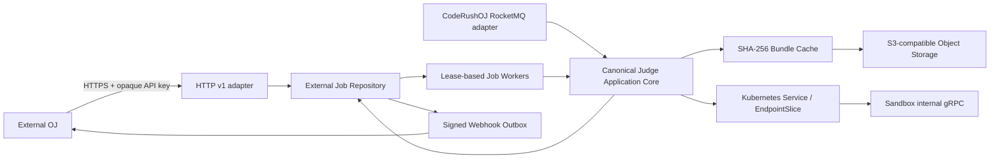

# CodeRushOJ External HTTP Judge API Design

Date: 2026-07-19  
Status: approved direction; contract review pending

## 1. Goal and completion definition

CodeRushOJ Judging Server must be usable by CodeRushOJ and by an unrelated OJ without exposing RocketMQ, the backend database, Kubernetes discovery, or the Sandbox gRPC contract. The HTTP API is an adapter over the same judge application core used by the existing RocketMQ consumer; it is not a second judge implementation.

The v1 feature is complete when an authenticated external tenant can upload an immutable hidden-test bundle, submit an idempotent asynchronous job, poll or cancel it, receive a signed webhook, and retrieve a durable redacted result after a Judging Server restart. Multi-replica claims, quotas, tenant isolation, OpenAPI, metrics, graceful shutdown, and end-to-end tests are required. Payment is out of scope.

## 2. Chosen architecture



Three approaches were considered:

1. Synchronous HTTP was rejected because compilation and multi-case execution routinely exceed proxy deadlines and make retry ambiguity unavoidable.
2. Asynchronous REST was selected because it is universally consumable, durable, observable, and naturally idempotent.
3. Public gRPC remains a possible future adapter for high-throughput clients, but Sandbox gRPC stays private and is never the public contract.

The external API uses a service-owned MySQL database named `coderushoj_judge` for durable clients, bundle ownership, jobs, attempts, idempotency records, and webhook deliveries. Versioned SQL migrations are embedded in the Judging Server binary and use their own migration history; the backend does not own this schema. Workers claim jobs with a lease using transactional row locking; an expired lease is reclaimable after process or Pod failure. Redis provides cross-replica rate limiting but is not a source of truth. CodeRushOJ's existing RocketMQ path remains available and maps its immutable submission snapshot to the same canonical execution request.

## 3. Public HTTP v1 contract

All endpoints are under `/api/v1`. JSON decoders reject unknown fields. Errors use RFC 9457 `application/problem+json` with a stable machine-readable `type`, `status`, `title`, `detail`, and `requestId`.

### 3.1 Capabilities

Authenticated `GET /api/v1/capabilities` returns supported languages, compiler/runtime identifiers, judge modes, checkers, maximum source/bundle/case sizes, maximum case count, and API version. Clients must submit the immutable language identifier returned here rather than an arbitrary shell command.

### 3.2 Bundles

`POST /api/v1/bundles` accepts `multipart/form-data` with one deterministic bundle ZIP and an `Idempotency-Key` header. The server streams and validates the upload, writes it to a unique tenant staging key, and commits PENDING ownership. A database CAS lease elects one promoter, which copies to the content address, verifies remote size and SHA-256 metadata, and only then marks the row READY:

`external/<tenant-id>/sha256/<lowercase-sha256>.zip`

The response is `201 Created` for the first accepted upload and `200 OK` for an idempotent replay. A concurrent request that does not own the publication lease receives retryable `503`. It contains `bundleId`, `sha256`, `sizeBytes`, `caseCount`, `manifestVersion`, and `createdAt`. Hidden files and a download URL are never returned. `GET /api/v1/bundles/{bundleId}` returns READY metadata only. A durable reconciler reclaims expired leases, applies bounded backoff, and marks exhausted or staging-less legacy rows ABANDONED; migrations never infer READY without remote verification.

The API never accepts a caller-provided object URL. This prevents SSRF, DNS rebinding, cloud metadata access, and credential ambiguity. Physical cross-tenant deduplication may occur internally, but authorization is always checked through a tenant-owned metadata row so object existence cannot be used as a cross-tenant oracle.

### 3.3 Judge jobs

`POST /api/v1/judge-jobs` requires an `Idempotency-Key` and accepts:

```json
{
  "bundleId": "bnd_01...",
  "language": "cpp",
  "sourceCode": "#include <iostream>...",
  "stopOnFailure": true,
  "callbackId": "cb_01...",
  "clientReference": "submission-123"
}
```

Limits and checker configuration come from the validated immutable bundle and server policy; a tenant cannot raise CPU, memory, process, output, or wall-clock ceilings through the request. `callbackId` refers to an operator-registered HTTPS destination and is optional. Raw callback URLs are prohibited.

The response is `202 Accepted` and includes `jobId`, `status`, `statusUrl`, `createdAt`, and the echoed `clientReference`. The unique key `(tenant_id, idempotency_key)` stores a canonical request hash. A replay with the same hash returns the original response; reuse with different content returns `409 Conflict`.

`Idempotency-Key` is 16–128 visible ASCII characters, is never logged, and is retained for the configured idempotency window. Source is streamed to a tenant-owned encrypted object rather than stored as plaintext in MySQL. The database stores only its object reference, byte count, and SHA-256. The encryption provider is an interface: local deployments use application-side AES-256-GCM with a versioned Kubernetes Secret key; production can use envelope encryption backed by a cloud KMS. Source objects are deleted by the retention workflow only after no active attempt references them.

`GET /api/v1/judge-jobs/{jobId}` returns one of `QUEUED`, `RUNNING`, `SUCCEEDED`, `FAILED`, or `CANCELLED`. `SUCCEEDED` means the judge completed normally and may contain any contestant verdict, including Wrong Answer or Compile Error; `FAILED` is reserved for a terminal infrastructure/system failure after its retry policy is exhausted. Terminal results include the overall verdict, compile status, maximum time and memory, and ordered per-case IDs/verdicts/metrics. They never contain source code, hidden input/output, expected output, arbitrary Sandbox diagnostics, object keys, credentials, or Pod addresses. Cross-tenant IDs return `404` rather than revealing existence.

`POST /api/v1/judge-jobs/{jobId}/cancel` is idempotent. A queued job transitions immediately to `CANCELLED`; a running job records cancellation intent and stops between compile/case boundaries. Terminal jobs are unchanged and returned as-is. Hard process termination remains the Sandbox's responsibility.

List access is provided by `GET /api/v1/judge-jobs?cursor=...&limit=...&status=...`. Pagination is cursor-based and stable by `(created_at, id)`.

## 4. Authentication, tenants, and quotas

External clients authenticate with `Authorization: Bearer <opaque-key>` over TLS. Keys contain a public lookup prefix and at least 256 bits of randomness. The database stores only `HMAC-SHA256(server-pepper, full-key)` and lookup prefix; verification is constant-time. Keys have tenant, scopes, creation time, optional expiry, last-used time, and revocation time. Scopes are `capabilities:read`, `bundle:write`, `bundle:read`, `job:submit`, `job:read`, and `job:cancel`.

Operators create, rotate, list, and revoke clients with a `judge-admin` CLI that writes through the same repository and prints a new secret exactly once. Runtime Secret values and the verifier pepper are injected from Kubernetes Secret and never committed or logged. A future OIDC client-credentials adapter can be added without changing the job API.

Redis implements a per-tenant token bucket for request rate and upload bytes. MySQL-enforced tenant policy limits queued jobs, concurrent running jobs, source size, retained bundles, and daily execution budget. An established quota violation returns `429`; inability to establish quota state returns retryable `503` and fails closed for new writes, while existing job reads remain available. Workers enforce global and tenant concurrency before claim, so adding HTTP replicas cannot bypass quotas.

## 5. Durable execution and state machine

External job state is authoritative in MySQL:

```text
QUEUED -> RUNNING -> SUCCEEDED
                  -> FAILED
QUEUED ----------> CANCELLED
RUNNING ----------> CANCELLED
```

Each claim stores `worker_id`, `lease_until`, and monotonically increasing `attempt_no`. Workers heartbeat long jobs. A worker may reclaim only an expired non-terminal attempt. Result persistence uses compare-and-set on `(job_id, attempt_no, RUNNING)` so a late worker cannot overwrite a newer attempt. Retryable Sandbox discovery/overload/network failures release the claim with bounded exponential backoff until the tenant policy's maximum attempt count; deterministic invalid bundle/config failures and exhausted attempts finish as `FAILED`. A terminal job and its webhook outbox record are committed in one transaction.

The canonical application request contains tenant/request identity, language ID, source bytes, immutable bundle descriptor, policy-derived limits, and cancellation context. The execution core owns bundle verification, EndpointSlice scheduling, compile-once batch execution, verdict aggregation, and redaction. Neither HTTP handlers nor RocketMQ consumers call Sandbox directly.

## 6. Webhooks

Callback destinations are pre-registered by operators and restricted to HTTPS, explicit host/port allowlists, public routable addresses, and resolved-IP revalidation on every delivery. Redirects are disabled. This blocks arbitrary-request SSRF and DNS rebinding.

Terminal event bodies contain `eventId`, `eventType`, `occurredAt`, `tenantId`, `jobId`, `clientReference`, and the same redacted result returned by `GET`. Delivery uses:

- `X-CodeRushOJ-Event-Id`
- `X-CodeRushOJ-Timestamp`
- `X-CodeRushOJ-Signature: v1=<hex HMAC-SHA256>`

The signature input is the unambiguous byte sequence `v1\n<event-id-byte-length>\n<event-id>\n<timestamp>\n<raw-body>`. The sender rejects any mismatch or duplicate between the header and body `eventId`. Secrets are tenant/callback specific and shown once. Delivery is at least once with exponential backoff and jitter; `2xx` acknowledges, `408/425/429/5xx` retries, and other `4xx` terminate delivery with an auditable failure. The outbox retains attempt count, next attempt, last status, and a redacted error. Clients deduplicate by the signed `eventId` and reject timestamps outside their configured replay window.

## 7. Lifecycle, observability, and retention

The binary runs HTTP, RocketMQ, lease workers, and webhook workers under one cancellation tree. Startup validates secrets, repository migrations, object storage, and policy configuration before readiness. Shutdown first fails readiness, stops accepting writes, stops new claims, and lets in-flight work finish within the grace period before releasing leases.

Structured logs include `requestId`, `tenantId`, `jobId`, and `attemptNo`, but never API keys, source, hidden cases, callback secrets, or Sandbox free text. Metrics cover request latency/status, auth failures, quota rejection, queue depth/age, claim/reclaim count, execution duration/verdict, bundle cache hit ratio, webhook attempts, and lease expiry. OpenTelemetry trace propagation is accepted through HTTP and attached to internal spans without forwarding untrusted baggage to Sandbox.

Default retention is configurable: idempotency records 24 hours, terminal jobs 30 days, webhook deliveries 30 days, and unreferenced external bundles 7 days. A database-backed sweeper marks rows before object deletion and retries safely; object deletion never races a referenced job.

## 8. Testing and delivery gates

Implementation follows test-first slices:

1. strict request decoding, RFC 9457 errors, authentication, scopes, and idempotency;
2. streaming bundle upload, tenant isolation, validation, and atomic object publication;
3. durable job state, leases, expiry reclaim, CAS completion, cancellation, and restart recovery;
4. canonical core adapter shared by HTTP and RocketMQ;
5. signed webhook delivery, retry matrix, SSRF controls, and replay-safe examples;
6. graceful shutdown, metrics, OpenAPI 3.1, CLI provisioning, and retention sweeper.

Unit tests use fakes only at repository/object/network boundaries. Integration tests use MySQL, Redis, S3-compatible storage, a fake Kubernetes EndpointSlice API, real TCP gRPC Sandbox, and `httptest` HTTP/webhook servers. Required E2E proves: provision tenant, upload bundle, submit Accepted and Wrong Answer jobs, replay idempotency, restart during RUNNING, reclaim once, receive one logical terminal result, verify webhook signature, cancel a queued job, and prove cross-tenant bundle/job access is denied.

CI runs `go test -race ./...`, `go vet ./...`, a static build, OpenAPI lint/compatibility checks, migration tests, container inspection, SBOM, Trivy, and the external-OJ E2E. The feature remains a Draft PR until all gates and independent Critical/Important review findings are green.

## 9. Compatibility and rollout

HTTP v1 is additive. Existing RocketMQ message and backend callback contracts remain unchanged. The Helm chart adds a private-by-default HTTP Service port; external exposure requires an explicit Gateway route, TLS, rate limits, and Secret references. The first release is marked beta while the `/api/v1` schema is compatibility-checked. Breaking changes require `/api/v2`.

Rollout order is Sandbox compile-once batch, Judging core batch adapter, external API persistence/migrations, HTTP and webhook adapters, then platform Gateway/E2E. No component is merged to `main` until its dependency PR and full CI are green.
